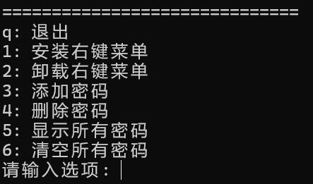
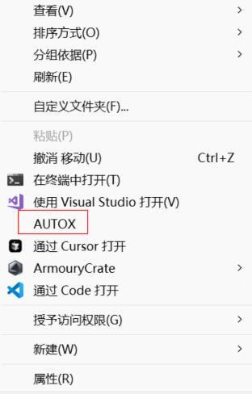

# AUTOX - 批量解压

一个简单的批量解压工具，可以管理密码库并集成到Windows右键菜单，实现一键批量解压。

下载地址: [Release](https://github.com/CurssedCoffin/AUTOX/releases)

## 1. 主要功能

* **批量解压**：使用7z批量解压目录下的压缩文件。
* **密码库**：可以在程序中配置密码并明文存储在```password.json```文件中，解压时会自动尝试。
* **右键菜单集成**：在程序中安装右键菜单后，可以右击文件夹空白处，快速对当前目录下的压缩包进行解压。

## 2. 如何使用

**直接打开**

- 直接打开程序为配置模式，可以进行右键菜单 安装/卸载 和密码管理。



**通过右键菜单打开或将文件夹拖入程序**

- 程序将自动开始解压当前文件夹里的所有压缩包。

- 解压后的压缩包不会被删除，而是被移动到目录下的 ```_done```文件夹下。

- 如果解压后的结果里首级目录也存在压缩包，则会尝试解压，该子目录压缩包不会被移动或删除。该过程仅进行一次，不会递归调用。

  

## 3. 编译为EXE

1. 克隆本项目
```bash
git clone https://github.com/CurssedCoffin/AUTOX
```

2. 安装依赖
```bash
pip install -r requirements.txt
```

3. 编译并将bin文件下的7z捆绑到程序中
```bash
pyinstaller -F --add-data "bin;bin" autox.py
```

4. 编译好的程序在项目目录下 ```dist/autox.exe```

## 4. 声明

项目 ```bin/windows``` 目录下的二进制文件：
```
bin/windows/
    7z.dll
    7z.exe
```

是从 [7-zip 官方下载页面](https://www.7-zip.org/download.html) 的 64-bit Windows x64 版本安装程序中提取的。

版本为 7-Zip 24.09 (2024-11-29)。
